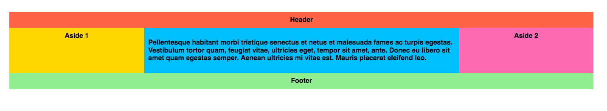
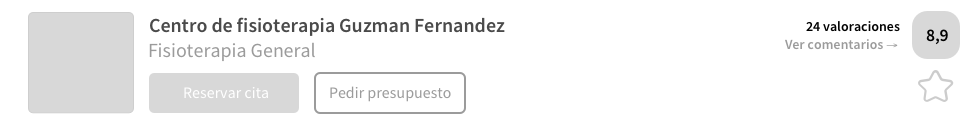

## Ejercicios de Flexbox

### Ejercicio 1. Layout

Convertir la imagen anterior a código usando HTML y CSS y lo que habéis aprendido hoy de Flexbox. Los requisitos son los siguientes:

- Las medidas tienen que ser relativas, es decir, los elementos de la página deben adaptarse al ancho de la ventana del navegador web. Si el tamaño de la ventana aumenta, el tamaño de los elementos debe aumentar.
- El ancho del conjunto entero debe ser del 100% con un ancho máximo de 960px
- Cada bloque debe de crearse con una etiqueta HTML5 (header, footer, aside...) y debe tener un título que esté centrado (como aparece en la imágen).
- El bloque central (que sería un article), en vez de tener un título, tendrá un párrafo con un texto aleatorio, podéis escribir dentro lo que queráis dentro de él.

### Ejercicio 2. Cabecera

Convertir la imagen anterior a código usando HTML y CSS y lo que habéis aprendido hoy de Flexbox. Los requisitos son los siguientes:

- En este caso si el tamaño de la ventana aumenta solo aumentará el tamaño del bloque central, el bloque gris de la izquierda y el grupo que compone la puntuación, texto y estrella de la derecha siempre tendrán el mismo tamaño (ejemplo abajo)

- El ancho del conjunto entero debe ser del 100% con un ancho máximo de 840px
- Para el bloque gris de la izquierda debéis buscar una imagen cuadrada y colocarla ahí
- No os preocupeis por el tamaño de cada elemento, lo importante es que el resultado tenga una composición similar
- Para redondear los bordes debéis usar `border-radius` con unidades en pixel (por ejemplo, `border-radius: 5px`)

### Dudas

Si tenéis alguna duda buscad en Google: “mdn ” seguido del nombre de la propiedad. Si después de buscarlo no encontráis nada, intentad buscarlo en StackOverflow  en español. También se puede buscar en Google: “Cómo hacer … con CSS”

Si despues de buscar no encontrais la solución, preguntadnos por Slack, intentaremos ayudaros y resolver vuestras problemas o dudas. (lo sé, soy pesado 😉)
