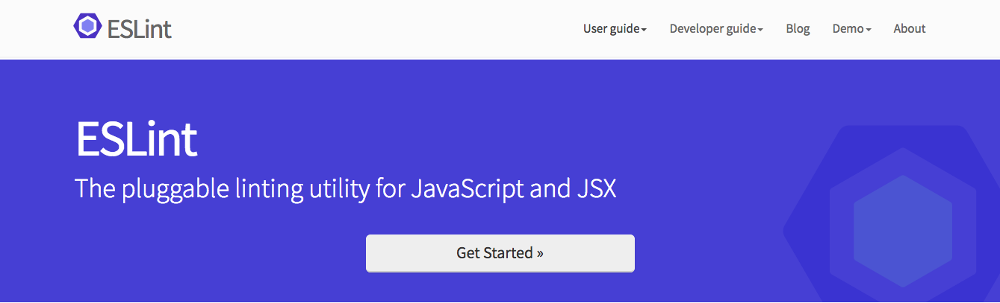
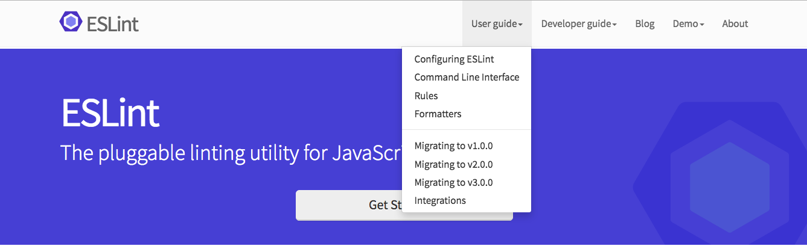
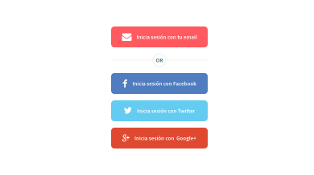
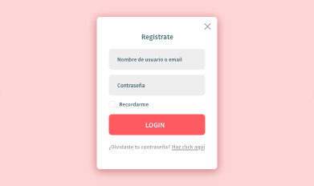

## Mostrando elementos de forma interactiva

En este ejercicio vamos a aprender a usar CSS y JavaScript para mostrar elementos de forma interactiva. Para ello tenemos que saber cuando usar uno u otro, la regla para entenderlo es la siguiente:
Usaremos CSS para mostrar u ocultar elementos cuando situemos el cursor del ratón encima de un elemento que contenga al que queremos mostrar.
Usaremos JavaScript para mostrar elementos al hacer click, en este caso no es necesario que los elementos tengan relación entre sí.

### Mostrando elementos con CSS

Para mostrar elementos con CSS utilizaremos `:hover` y accederemos al elemento usando selectores anidados (ej. `ul:hover li ul {/* estilos */}`)

Para aprender a usarlos vamos a replicar la barra (sólo la barra) de la siguiente imagen con HTML y CSS:



La imagen anterior muestra el estado que tendrá por defecto y la siguiente muestra el estado con :hover.



Para obtener la imagen del logotipo, abrimos esta página: http://eslint.org/img/logo.svg, pulsamos con el botón derecho sobre ella  y le damos a guardar página cómo… y nos guardará el SVG, que luego meteremos como imagen en nuestro HTML usando una etiqueta img. Para la fuente usaremos Source Sans Pro, es una fuente que está en Google fonts y podemos entrar en su página y ver cómo meterla en nuestro HTML

### Mostrando elementos con JavaScript

Como comentábamos, JavaScript se utiliza para cambiar elementos de forma interactiva mediante eventos. En este caso nos centraremos en el evento click, es decir, en la acción de pulsar sobre un elemento. Esta técnica se utiliza mucho para mostrar elementos al hacer click en un botón, mostrar alertas cuando sucede algo en la página, añadir productos a un carrito en las tiendas online, etc.
En este caso crearemos un modal con un registro que aparezca cuando pulsamos sobre un botón y tenga un formulario para registrarse, el diseño está en Zeplin y sería similar a la siguiente foto.



Ese sería el estado por defecto y, al pulsar en el botón rosa, aparecería un modal y tendríamos una vista como la siguiente (zeplin vista 2):



En esta vista, si pulsasemos sobre Login o sobre la cruz se cerraría el modal. Los campos del formulario tienen que ser funcionales, es decir, tienen que ser reales y poder funcionar como campos reales y los botones de redes sociales no tienen que tener ninguna funcionalidad, solo el botón rosa para abrir el modal.

Para este caso, el código clave de JavaScript es el siguiente:

- [`Elemento.style`](https://developer.mozilla.org/es/docs/Web/API/HTMLElement/style)
- [`Elemento.addEventListener()`](https://developer.mozilla.org/es/docs/Web/API/EventTarget/addEventListener)
- [`document.querySelector()`](https://developer.mozilla.org/es/docs/Web/API/Document/querySelector)

De esta manera lo que haríamos sería añadir un atributo style a nuestra etiqueta html. En html si una etiqueta, por ejemplo , tiene un atributo style, los estilos que contenga se le aplicarán, dentro de dicho atributo, podemos poner propiedades de css sin selector, ya que el selector en este caso será el propio elemento. Ejemplo:

```html
<p style=”color: red; font-family: sans-serif;”>Texto de prueba</p>
```

Utilizar estilos de esta manera de forma directa es una práctica desaconsejada porque dejariamos el HTML muy feo y muy dificil de mantener y cambiar. Sin embargo, hacerlo con JavaScript no se considera malo ya que nosotros unicamente modificaremos y editaremos el código JavaScript sin ver el resultado en el HTML

Para modificar los estilos de un elemento desde JavaScript existe tambien otra alternativa y es la de añadir o quitar clases a un elemento. En este caso, en vez de modificar, por ejemplo, boton.style.borderWidth = “20px”, lo que haríamos sería añadir una clase a dicho boton. Un ejemplo sería añadir la clase .activo cuando quisiesemos poner algo activo. Para hacer esto utilizaremos los siguientes métodos:


- `el.classList.remove(nombreDeLaClase)` para eliminar una clase concreta de un elemento HTML
- `el.classList.contains(nombreDeLaClase)` para ver si un elemento HTML contiene una clase
- `el.classList.add(className) para añadir` una clase a un elemento HTML
- `el.classList.toggle(nombreDeLaClase)` es una mezcla de las tres anteriores. Mira si un elemento tiene una clase, si la tiene se la quita y sino se la añade

Si poneis en Google _“mdn classList”_ seguido del nombre del método (`toggle`, `add`, `contains`...) os aparecerá más información acerca de cómo usarlos

Estaría bien que probaseis a hacer dos versiones de este ejercicio en JavaScript, una con **`styles`** y la otra con **`classList`**
