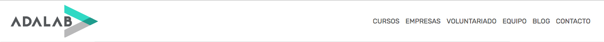

## Cabecera Adalab con Sass

Para este ejercicio tendremos que replicar la barra de navegación de la página web de AdaLab. La que aparace a continuación:



Para ello utilizaremos [Sass](http://sass-lang.com/) y crearemos variables y estilos anidados. En este caso crearemos los estilos para todos los tamaños, empezando por el tamaño para móvil y añadiendo media queries para tamaños mayores:

```css
.boton {
  background-color: blue;
}

@media only screen and (min-width: 600px) {
   /* TABLET */
   .boton {
     background-color: red;
   }
}

@media only screen and (min-width: 900px) {
   /* ESCRITORIO */
   .boton {
     background-color: green;
   }
}
```

Tendremos que prestar especial atención a los siguientes detalles:

- Utilizaremos variables de Sass para colores y otras configuraciones que pensemos que podemos necesitar cambiar en un futuro. Estas variables deberán estar relacionadas con su funcion y no con su estilo, es decir, usaremos `$color-primario` en vez de `$color-azul`, por ejemplo.
- Utilizaremos estilos anidados donde nos sea más conveniente. Un caso muy tipico es usar un estilo anidado para los `:hover`
- Utilizaremos las funciones `darken` y `lighten` para hacer más claros u oscuros nuestros colores.
- Crearemos un mixin para usarlo para nuestros `@media queries`
- Usar etiquetas de HTML5 como `nav` o `header`
- Crear estilos identicos a los de la barra
- Usar la misma fuente y los mismos colores que en el diseño original. Podemos obtenerlos inspeccionando el HTML de adalab.es
- Añadir los estilos para los :hover del icono y de los enlaces, es decir, añadir los estilos para que cuando pongamos el cursor sobre el icono del menú o los enlaces, estos se muestren en azul
- Repasar que el documento está bien revisando el documento de mejoras para las webs que creamos y comprobando que no hemos realizado ningún fallo

Una vez hayamos realizado lo anterior, intentaremos realizar las siguientes tareas:

- Hacer que, en pantallas móviles, cuando se pulse en el botón del menú aparezca el menú tal y como aparece en la web de Adalab
- Añadir la transición del logo cuando la pantalla cambia de tamaño
- Añadir la transición del borde inferior en los enlaces para que cambie de transparente a azul de forma gradual en vez de bruscamente
