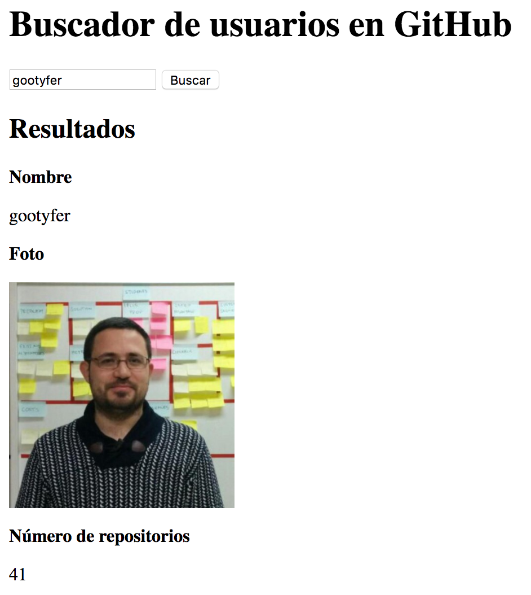

## AJAX usando jQuery

Hoy vamos a revisar un nuevo concepto AJAX, Asynchronous JavaScript And XML, que en realidad es una forma de hacer peticiones al servidor. Os dejo un ejemplo de cómo hacerlo y podéis ver más detalles en [la documentación del jQuery][1]:
- a la función `$.ajax` se le pasa un único diccionario (objeto) con varios parámetros
- el parámetro `url`  indica dirección de Internet (del servidor) donde pido los datos
- el parámetro `success` es una función que se ejecuta cuando la petición al servidor tiene éxito, y al que se pasan como parámetro los datos recogidos; que no os despiste que estamos definiendo la función en la misma línea pero podría estar definida fuera

```javascript
$.ajax({
  url: "https://api.github.com/users/gootyfer",
  success : function(data) {
    console.log(data)
  }
});
```
Podéis ver los [datos que devuelve el servidor][2] en formato JSON (JavaScript Object Notation) que es similar a los objetos / diccionarios que hemos visto. Este formato es el más habitual para intercambiar datos en aplicaciones de Internet.

Sobre este ejemplo, os propongo varios ejecicios para practicar el uso de AJAX con el API (Application Programming Interface, interfaz para acceder a datos desde un programa) de GitHub.

### 1. Explorando AJAX
Vamos a partir del código anterior, y a explorar el formato de datos que nos devueve GitHub que hemos visto antes. Vamos a seguir los siguientes pasos:
- En el objeto de resultado identificamos el nombre del usuario
- Creamos un párrafo en HTML y ponemos dentro el nombre del usuario
- Hacemos lo mismo con su número de repositorios públicos
- Creamos un objeto imagen en el HTML, y pintamos la foto de perfil del usuario en GitHub modificando su atributo src

### 2. Buscando en GitHub
Sobre esta página vamos a crear un formulario, con un campo de texto para buscar un usuario en github y un botón. Por otro lado tenemos una sección de resultados con huecos vacíos para el nombre, número de repos y foto del usuario.

Al pulsar el botón, cogemos el nombre de usuario que han escrito en la caja de texto, buscamos su información en el API de GitHub, y la pintamos en la sección de resultados.

**¡Vaya webapp divertida que hemos hecho!**

<hr>


[1]: http://librojquery.com/#métodos-ajax-de-jquery
[2]: https://api.github.com/users/gootyfer