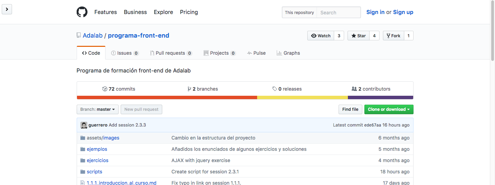
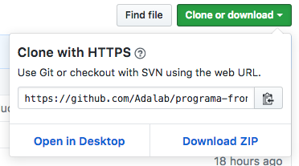

# Guía de referencia Git

## Índice

- [Configurar Git para trabajar desde Ubuntu](#configurar-git-para-trabajar-desde-ubuntu)
- [Clonar un repositorio ya existente en nuestro ordenador](#clonar-un-repositorio-ya-existente-en-nuestro-ordenador)
- [Hacer cambios en un repositorio](#hacer-cambios-en-un-repositorio)
<!-- - [Crear un nuevo repositorio desde GitHub]() -->
<!-- - [Subir a GitHub un repositorio ya existente]() -->
<!-- - [Deshacer un cambio en un repositorio](#estructura) -->
<!-- - [Resolver conflictos a la hora de subir cambios a un repositorio](#comentarios) -->
<!-- - [Eliminar un repositorio en GitHub](#metadatos) -->
<!-- - [Ver los cambios que hemos realizado desde el último commit (versión)] -->
<!-- - [Guardar los cambios realizados de forma momentanea](#texto) -->
<!-- - [Hacer que Git ignore ciertos archivos]() -->

## Introducción a la terminal y Git

### La terminal

- [Curso de introducción a GNU/Linux - ¿Qué es la Terminal? ](https://www.youtube.com/watch?v=5b7j-Keeokc)
- [Curso de introducción a GNU/Linux - Comandos Básicos](https://www.youtube.com/watch?v=esbup7hKv6E)

### Git

- [1.- Curso Git - Introducción a Git](https://www.youtube.com/watch?v=zH3I1DZNovk)
- [2.- Curso Git - Primeros pasos](https://www.youtube.com/watch?v=XXdaqtLgOGI)
- [2.- Curso Git - Nuestro primer proyecto](https://www.youtube.com/watch?v=vH9pkFf1D7M)
- [5.- Curso Git - Empezando con Github](https://www.youtube.com/watch?v=Qn186NyDqOk)

## Configurar Git para trabajar desde Ubuntu

#### 1. Comprobar que Git está instalado y actualizado

##### En Ubuntu

**Importante:** Antes de realizar los comandos de abajo es importante que sepas que tras ejecutarlos te pedirá que introduzcas la contraseña de tu ordenador. A medida que la escribas no aparecerá nada por seguridad, así no se verá tu contraseña. Aunque no se muestre nada, puedes teclear tu contraseña y pulsar intro y, si es correcta, procederá con la ejecución de los comandos.

Primero abrimos la terminal e introducimos el comando de abajo y pulsamos intro. Esto nos permitirá actualizar Git en caso de que no esté actualizado ya:

```shell
sudo apt-get install git
```

Después utilizaremos este comando para instalar herramientas adicionales de Git que probablemente usaremos en el futuro:

```shell
sudo apt-get install git-all
```

##### En Mac


**Importante:** Antes de realizar los comandos de abajo es importante que sepas que tras ejecutarlos te pedirá que introduzcas la contraseña de tu ordenador. A medida que la escribas no aparecerá nada por seguridad, así no se verá tu contraseña. Aunque no se muestre nada, puedes teclear tu contraseña y pulsar intro y, si es correcta, procederá con la ejecución de los comandos.

Primero abrimos la terminal e introducimos el comando de abajo y pulsamos intro. Esto nos permitirá instalar un gestor de paquetes en Mac llamado `Homebrew`, que nos ayudará a instalar herramientas como Git de forma sencilla. Al pulsar intro, se empezarán a imprimir lineas en nuestra Terminal y nos pedirá que pulsemos Intro para continuar con la instalación del gestor de paquetes, este gestor es de código abierto, seguro y está mantenido por una gran comunidad, por lo que no tenemos por qué preocuparnos:

```shell
/usr/bin/ruby -e "$(curl -fsSL https://raw.githubusercontent.com/Homebrew/install/master/install)"
```

Despues de haber instalado `Homebrew`, podremos instalar la última versión de Git de forma simple con el siguiente comando:

```shell
brew install git
```

Una vez haya terminado de instalarse Git, tendremos todo listo para continuar con el siguiente paso.

#### 2. Añadimos nuestro nombre a la configuración de Git

Abrimos la aplicación de la terminal e introducimos el siguiente comando, tal y como se muestra abajo, sustituyendo `"John Doe"` por nuestro nombre y pulsamos intro para que se ejecute el comando.

**Importante:** Siempre escribiremos nuestro nombre entre comillas para evitar problemas a la hora de ejecutar el comando

```shell
git config --global user.name "John Doe"
```

#### 3. Configuramos nuestro email para trabajar con Git

Ahora introducimos el siguiente comando para guardar la configuración de nuestro email:

```shell
git config --global user.email "johndoe@example.com"
```

Sustituiremos en este caso `"johndoe@example.com"` por el email que hemos utilizado para crear nuestra cuenta de GitHub.

**Nota:** Es importante que el email coincida ya que GitHub lo utilizará para comprobar nuestros credenciales a la hora de subir información a un repositorio y mostrar

#### 4. Añadimos la configuración para que se guarde nuestra contraseña para GitHub

Por defecto, cada vez que intentamos conectarnos con GitHub, el servidor de GitHub nos pedirá la contraseña de nuestro usuario. Como vamos a subir y descargar cambios de GitHub de forma constante, puede ser un poco molesto tener que introducir la contraseña cada vez que queramos conectarnos con el servidor. Para evitar esto, vamos a almacenar la contraseña de forma segura en nuestro ordenador.

##### En Ubuntu

Para poder almacenar la contraseña de GitHub en Ubuntu, realizaremos los siguientes comandos uno por uno:

1. `sudo apt-get install libgnome-keyring-dev`
1. Nos solicitará una contraseña, aquí debemos introducir la contraseña de nuestro ordenador, no la de GitHub.
1. `cd /usr/share/doc/git/contrib/credential/gnome-keyring`
1. `sudo make`
1. `cd -`
1. `git config --global credential.helper /usr/share/doc/git/contrib/credential/gnome-keyring/git-credential-gnome-keyring`

Al hacer esto, la próxima vez que introduzcamos nuestra contraseña de GitHub, esta se almacenará de forma segura en nuestro ordenador y no será necesario volver a introducirla de nuevo.

##### En Mac

Para poder almacenar la contraseña de GitHub en Mac, simplemente ejecutamos el siguiente comando:

```shell
git config --global credential.helper osxkeychain
```

Una vez hayamos realizado ese paso, no necesitaremos hacer ningún cambio más.

## Clonar un repositorio ya existente en nuestro ordenador

Para clonar un repositorio desde GitHub, lo primero que haremos será ir a la página principal del repositorio. En este caso, como ejemplo, utilizaré [el repositorio dónde tenemos almacenada la información de este curso](https://github.com/Adalab/programa-front-end).

 

 Una vez estamos ahí, pulsaremos sobre el botón _"Clone or download"_ para poder visualizar la URL que utilizaremos para clonar el repositorio. Seleccionamos la URL y la copiamos o pulsamos directamente en el botón de copiar al portapapales y se nos copia automáticamente.

 

Ahora que ya tenemos la dirección del repositorio, simplemente tendremos que colocarnos (utilizando la terminal) a la carpeta en la que queremos descargar la información del repositorio y ejecutar el comando para clonarlo (descargarlo). Para ello, mediante el comando `cd` navegaremos entre las carpetas de nuestro ordenador desde el terminal y con el comando `git clone` copiaremos la carpeta.

Por ejemplo, imaginemos que quiero clonar el repositorio en mi carpeta `Descargas`. Para clonarlo tendría que realizar los siguientes pasos:

1. Me coloco desde el terminal en la carpeta descargas usando `cd ~/Descargas`
2. Clono el repositorio usando `git clone https://github.com/Adalab/programa-front-end.git`

Tras ejecutar esos comandos me aparecería una nueva carpeta llamada `programa-front-end` en `Descargas` que contendrá toda la información de mi repositorio. La URL que he introducido (`https://github.com/Adalab/programa-front-end.git`) es la URL del repositorio de este curso, en vuestro caso tendrías que introducir la URL del repositorio que queráis clonar.

Una vez hemos clonado el repositorio, utilizaremos el comando `cd` para colocarnos dentro de él y poder trabajar desde ahí. Por ejemplo, en mi caso, tendría que utilizar `cd programa-front-end` para colocarme dentro de la carpeta del repositorio y poder trabajar desde ahí.

## Hacer cambios en un repositorio

Para hacer cambios en un repositorio, realizamos los siguientes pasos

1. Abrimos la aplicación de Terminal y nos desplazamos hasta el repositorio en el que estamos trabajando con `cd`. (Ejemplo: `cd ~/Descargas/programa-front-end`
2. Antes de cambiar ningún archivo, descargaremos los últimos cambios del repositorio remoto, es decir, los últimos cambios que se hayan subido a GitHub (por otras personas o por nosotros desde otro ordenador). Para ello usaremos `git pull origin master`.
3. Una vez que tenemos los últimos cambios descargados, realizamos las modificaciones de los archivos.
4. Tras modificar los archivos, ejecutamos `git status` para ver qué hemos cambiado.
5. Usamos `git add ruta/del/archivo` donde _ruta/del/archivo_ será la ruta del archivo del que queramos añadir los cambios para que cuando hagamos el commit se añadan
6. Usamos `git commit -m "Mensaje descriptivo"` para crear un commit, es decir, una nueva versión del repositorio.
7. Subimos los cambios a Git con `git push origin master`.
